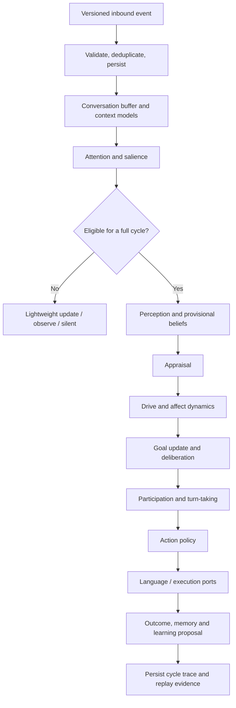

# AELIA AGENT — ARCHITECTURE STATUS REPORT

## Implementation results, fidelity to the target architecture, and the conditions still missing

**Report date:** 24 August 2026
**Figures re-measured:** 21 September 2026 at commit `68a3359` _(marked inline; unmarked figures are as of the report date)_
**Assessment scope:** the local working tree of the `AELIA` repository
**Target architecture:** controlled rewrite from Rust V1 to Python
**Overall status:** local runtime backend and platform gates complete up to the live-canary boundary; sending data to a real platform is **not** authorised

> **Revision note (2026-09-22).** This is the English translation of
> `BAO_CAO_HIEN_TRANG_KIEN_TRUC_V2.md`, with the quantitative figures refreshed
> against a read-only measurement of the working tree at `68a3359`. The prose
> and the conclusions are the original author's and have not been rewritten.
> Three claims in the original are **now factually superseded** and are marked
> `[SUPERSEDED]` where they appear — the source-control status (§1, §8.3, §9.1D),
> the ADR count (§8.3), and the connector status (§5). A full cross-check of
> every document under `docs/` against the implementation is recorded in
> `.aelia/coordination/ARCHITECTURE_GAP.md`.

---

## 1. Executive summary

AELIA has completed most of the architectural foundation required by the
*AELIA Agent restructure report* of 29 July 2026. The new kernel is written in
Python as a modular monolith, with strict data contracts, a sequential cognitive
cycle, state that carries causal weight, SQLite storage, and trace/replay.

The main components are present and tested:

- persona preservation and structuring;
- observation loop, attention, and conversation buffer;
- World, Belief, Self, Social, and Conversation Models;
- appraisal, drive, and affect dynamics;
- goal lifecycle, deliberation, participation, turn-taking, and action policy;
- memory, outcome, and controlled learning proposals;
- initiative and autonomy guardrails in shadow mode;
- adapter contract, transactional outbox, idempotency, and crash recovery;
- a CLI for configuration checks, replay, trace, and simulated test-canary.

Most recent local verification:

| Item | Result |
|---|---:|
| Automated tests | **191 Python tests and 40 Node tests pass** _(re-measured 2026-09-21; originally 182 and 34)_ |
| Ruff format/lint | Pass _(re-measured 2026-09-21)_ |
| Strict mypy | Pass on `src` and `tests` — **112 source files checked** _(re-measured 2026-09-21; originally 102)_ |
| Persona | Valid; **43 rules, 18 scenarios** |
| SQLite | **8 migrations**; integrity check returns `ok` |
| V1 preservation | 205/205 files preserved byte-for-byte |
| V1 Cargo workspace | 13/13 packages recognised |

**Governance conclusion.** The kernel is ready for source review and now has an
independent local runtime backend. The OpenAI-compatible provider probed
successfully; model `uai/claude-sonnet-4-6` was listed, and a full runtime HTTP
smoke produced content through the backend. Three Node.js connectors —
`discord-selfbot`, `discord-officialbot`, and `telegram-officialbot` — are
implemented independently, but default to send-off and have not run a live
canary. So this is **not a production release**.

One item had to be settled before formal acceptance: the whole tree, including
the V1 migration, sat in a local working tree — **not committed, not pushed, and
with no pull request open**. The current result was therefore local evidence
rather than an artifact reviewed through source control.

> `[SUPERSEDED]` As of 2026-09-21 the tree **is** committed and pushed to
> `origin/rebrand/aelia` (`e6aa49c`, `68a3359`). No pull request is open and
> `main` has not been merged, so the review step itself is still outstanding —
> but the "no commit, no push" blocker is closed. See
> `.aelia/coordination/CURRENT_STATE.md` §1.

---

## 2. Scope and basis of assessment

This report compares three sources:

1. the target architecture in the original restructure report;
2. the source and tests currently in the repository;
3. the acceptance documents, ADRs, runbook, and evidence matrix.

It distinguishes three status levels:

- **Local pass** — implemented, with local test evidence;
- **Pass, limited** — the architecture and the safety mechanism exist, but have
  not run against a real service;
- **Not done** — requires a decision, access, or an external environment.

Nothing in this report claims that the system has been production-tested, has
sent a real message, or has replaced a running system.

---

## 3. Architectural decisions that have been realised

### 3.1 A 100% Python kernel

The kernel is implemented in Python 3.12+ and does not depend on the Rust
runtime. Rust V1 was not ported line by line and is not used as a behavioural
standard.

Runtime dependencies are kept small:

- `pydantic` and `pydantic-settings` for contracts and configuration;
- `aiosqlite` for persistence;
- no ORM;
- no graph database;
- no vector database;
- no workflow engine;
- no platform SDK inside the kernel.

### 3.2 Modular monolith

The system is currently one logical process, divided into modules by
responsibility:

```text
src/aelia/
├── app/          # configuration and logging
├── contracts/    # event, action, trace, adapter, connector
├── persona/      # persona source, selector, disclosure, participation bias
├── models/       # world, belief, self, social, conversation, goal, memory
├── cognition/    # attention → perception → appraisal → policy
├── autonomy/     # initiative and guardrails
├── llm/          # prompt registry and boundary
├── runtime/      # orchestrator, ports, replay, observability
├── storage/      # SQLite, migrations, repositories
├── adapters/     # adapter runtime and conformance
└── cli.py        # local operating tooling
```

There are now **73 Python source files / 13,490 lines** and **39 test files**
_(re-measured 2026-09-21; originally 67 and 35)_. These figures describe the
current size only, and must not be used in place of a quality assessment.

### 3.3 An explicit cognitive cycle

The main flow is sequential and traceable:



Async work and side effects are confined to the boundaries. The kernel does not
use an event bus to replace mandatory calls inside the cognitive cycle.

### 3.4 The LLM is a component, not the policy authority

The architecture separates:

- action selection;
- content-plan generation;
- language generation;
- side-effect execution.

The LLM may not directly:

- modify canonical state;
- write beliefs durably on its own;
- choose and execute tools;
- bypass permission or guardrails;
- send data out to a platform by itself.

The OpenAI-compatible provider currently uses async Chat Completions, typed and
redacted configuration, JSON output validation, and bounded retry. The model may
only generate the `content` field for an action that has already been selected.
Endpoint and authentication probed successfully; `uai/claude-sonnet-4-6` was
listed, and a completion smoke through the backend produced content.

---

## 4. Fidelity to the strategic problems identified in V1

| ID | Problem in the original report | Treatment in the rewrite | Assessment |
|---|---|---|---|
| P01 | Persona depends on the prompt | Persona has source hashes, rule provenance, Self/Social Model, and policy causality | Local pass |
| P02 | State is merely descriptive | Appraisal, drive, and affect change attention, retrieval, goals, and action scores | Local pass |
| P03 | Worker/event overuse | The main cognitive cycle uses a sequential orchestrator | Local pass |
| P04 | Crate fragmentation | Python modular monolith, with dependency direction enforced by test | Local pass |
| P05 | Scattered config precedence | Typed settings and `config doctor` for resolved configuration | Local pass |
| P06 | Conflicting memory stores | SQLite is the canonical store; projections must be rebuildable | Local pass |
| P07 | Affect runs post-hoc | Appraisal and internal dynamics run before action policy | Local pass |
| P08 | The LLM decides too much | The LLM sits behind policy, reached through typed ports | Local pass |
| P09 | Missing observation loop | Bounded buffer, reply graph, salience, and lightweight update | Local pass |
| P10 | Missing participation policy | `observe`, `silent`, `wait`, `reply`, `join` exist; reaction and live initiate are not enabled | Pass, limited |
| P11 | Missing turn-taking | Saturation, ownership, and anti-interruption rules exist | Local pass |
| P12 | Missing initiative manager | Triggers, budget, and audit exist, but it runs shadow-only | Pass, limited |
| P13 | Missing deterministic replay | inspect/replay/compare/export/redact exist | Local pass |
| P14 | Inconsistent failure semantics | Unit of work, rollback, retry history, idempotency, and recovery | Local pass |
| P15 | Platform coupling | The kernel imports no SDK; the adapter uses its own contract | Local pass |
| P16 | The prompt is hidden code | The prompt registry has owner, version, schema, and hash trace | Local pass |
| P17 | Storage precedes the domain | SQLite-first, with a repository boundary | Local pass |
| P18 | Missing architecture governance | **17 ADRs**, Definition of Done, and a quality gate; no code review or approval record yet _(re-measured 2026-09-21; originally 13)_ | Partial |

Overall, V1's core architectural debts have been addressed at the design and
local-test level. What remains unproven lies in behaviour with a real model,
real connectors, and a real operating environment.

---

## 5. Status against the implementation roadmap

### Phase 0 — Freeze, inventory, and V1 preservation

**Status: complete locally, awaiting a Git record.**

- V1 was moved into [`legacy/v1-rust/`](../legacy/v1-rust/README.md).
- 205/205 implementation, configuration, and documentation files matched
  byte-for-byte.
- The Cargo workspace still resolves all 13 packages.
- `.env`, `.env.example`, `settings.json`, configuration, prompts, persona, and
  local data were retained.
- Build caches, `node_modules`, `.next`, and the model cache were moved to the
  macOS Trash; nothing was permanently deleted.
- V1 is no longer a runtime dependency or a production fallback.

What is missing is the official commit/tag/PR recording the archive state.

### Phase 1 — Python foundation

**Status: local pass.**

- Python package and lockfile;
- strict typed contracts;
- typed configuration;
- JSON logging with cycle/event correlation;
- SQLite event log;
- idempotent event ingest;
- CLI database, inspect, and replay;
- quality workflow for Ruff, mypy, and pytest.

### Phase 2 — Observation loop

**Status: local pass.**

- bounded conversation buffer;
- reply graph;
- attention/salience scoring with reason codes;
- lightweight update;
- a 100-message group-conversation fixture;
- direct-mention and anti-spam policy.

The agent is not required to run a full cognitive cycle for every message.

### Phase 3 — Persistent models and memory foundation

**Status: local pass.**

- World Model;
- Belief Model with confidence, evidence, and provenance;
- Self Model;
- Social Model;
- Conversation Model;
- canonical memory reference;
- persistence across restart;
- conflict and duplicate handling.

Observation does not automatically become fact. A belief may remain provisional
or contested.

> **Note (2026-09-22).** Every item in this phase is present in code, but a
> read-only measurement of the production database found the `beliefs` table
> holds **0 rows** after 4,085 cycles. The Belief Model is implemented and
> unpopulated. See `.aelia/coordination/ARCHITECTURE_GAP.md` G-38.

### Phase 4 — Appraisal, Drive, and Affect

**Status: local pass.**

- structured appraisal;
- drive/affect with inertia and decay;
- state deltas appear in the cycle trace;
- internal state participates in attention, memory retrieval, goal priority,
  participation, and action scoring.

This addresses V1's "emotion only changes the tone of voice" problem directly.

### Phase 5 — Goal, Deliberation, and Action Policy

**Status: local pass.**

- goal lifecycle and merge;
- typed action candidates;
- scoring with a reason breakdown;
- turn-taking;
- language/execution ports;
- structured failure outcome;
- a failed execution does not automatically mark the goal complete.

### Phase 6 — Participation

**Status: local pass within the current scope.**

Supported:

- `observe`;
- `silent`;
- `wait`;
- `reply`;
- guarded group `join`.

The agent can choose to join a group conversation without being tagged, but must
pass conversation ownership, saturation, anti-spam, and persona participation
rules.

Reactions and other richer outcomes are not enabled because no platform need has
been approved.

### Phase 7 — Initiative and autonomy

**Status: pass in shadow mode.**

Present:

- internal triggers;
- initiative proposals;
- actor/conversation opt-out;
- quiet hours;
- permission and privacy checks;
- rate, cost, and outbound budgets;
- minimum-value, risk, reversibility, and confirmation checks;
- autonomy audit log.

An initiative cannot produce a real outbound action. This is a deliberate safety
catch, not a technical defect.

> **Note (2026-09-22).** The catch is harder than "deliberate": it is enforced by
> a `Literal[False]` field and a database `CHECK` constraint, and no
> `GuardrailOutcome` member authorises an action. Additionally, the permission
> scopes the guardrails read and the scopes the connectors emit have **an empty
> intersection** — the check cannot pass for any input. See
> `.aelia/coordination/ARCHITECTURE_GAP.md` G-03, G-04, G-36.

### Phase 8 — Adapter boundary

**Status: boundary, offline connectors, and external receipt complete; no live
canary has run.**

Present:

- versioned adapter envelope;
- outbound command and delivery receipt;
- transactional outbox;
- reconnect and idempotency;
- crash-window recovery;
- `shadow` mode;
- allowlisted `test_canary` with a mock transport;
- allowlisted `external_canary`;
- connector capability preflight;
- a Discord self-bot Node.js process isolated from the kernel;
- a Discord official bot using `discord.js`;
- a Telegram official bot using the Bot API over HTTPS with a durable polling
  cursor;
- a common Node boundary for journal, kernel CLI, and receipt;
- a journal that prevents duplicate sends, and receipts of
  `sent/not_sent/unknown`.

There is no live evidence with real credentials or channels.

> **Note (2026-09-22).** `ExternalReceiptStatus` still has no producer anywhere
> in `src/`, so the external-canary finalisation path remains unexercised even
> offline. The connector capability contract declares
> `receipt_schema_version = "2.0.0"` while the adapter runtime emits `1.1.0`.
> See `.aelia/coordination/ARCHITECTURE_GAP.md` G-11.

### Phase 9 — Data migration and decommission

**Status: scope adjusted.**

Per the current product decision, V1 runtime data is not an asset that needs
migrating; the persona is the important asset that must be preserved.
Therefore:

- no numeric state or old memory store is migrated;
- the persona is preserved and hash-bound;
- V1 is isolated for reference;
- a production decommission cannot be declared, because no real platform
  cutover has happened.

### L9 — OpenAI-compatible LLM provider

**Status: local pass with the exact model; bounded persona evaluation and live
canary are still missing.**

Present:

- typed configuration for API base, API key, and model;
- secrets live only in the Git-ignored `.env` and are redacted from doctor/log;
- async `POST /chat/completions`;
- `json_object` by default, `json_schema` optional;
- timeouts, token/response limits, and at most three attempts;
- retry on connection-setup errors, HTTP 408/409/429, and server errors;
  ambiguous read/write errors are not retried;
- model errors are stored as a structured failed cycle;
- replay uses the recorded generation and does not call the provider again.

The `/models` probe succeeded and the owner-chosen model ID appears in the list.
A full synthetic Discord envelope through the backend completed with generated
content, `thinking_mode = "disabled"`, `max_output_tokens = 4096`, and no Discord
side effect.

---

## 6. Contracts, data, and recoverability

### 6.1 Current contract versions

| Contract | Version |
|---|---:|
| Kernel event | `2.0.0` |
| Kernel action | `2.2.0` |
| Kernel trace | `2.3.0` |
| Adapter inbound envelope | `1.0.0` |
| Adapter outbound command | `1.1.0` |
| Adapter delivery receipt | `1.1.0` |
| Connector capability | `1.0.0` |
| Future external receipt | `2.0.0` |

_(All eight values re-verified against `src/aelia/contracts/` on 2026-09-21 and
unchanged.)_

External receipt `2.0.0` is a prepared contract only, not yet wired into the
runtime.

### 6.2 SQLite migrations

Eight migrations currently cover:

1. event log and cycle foundation;
2. observation buffer, reply graph, and participation;
3. canonical social relationship state;
4. beliefs and internal cognitive state;
5. goals and idempotent outbound actions;
6. canonical memory, outcomes, and learning proposals;
7. initiative guardrails, opt-outs, and audit;
8. adapter ingress and the transactional dispatch outbox.

_(Migration names re-verified against `src/aelia/storage/migrations.py` on
2026-09-21 and unchanged.)_

SQLite is the single canonical source of durable state. Working memory is
derived from the bounded conversation buffer. No graph or vector store has been
added, because no need has been evidenced.

### 6.3 Failure and recovery

There is local evidence for:

- duplicate ingress does not create a duplicate cycle;
- reconnect reuses the stored ingress/cycle;
- transaction rollback on state contention;
- retry with history and bounds;
- reserved dispatches are recovered;
- the mock transport uses an idempotency key;
- a failed execution produces a structured outcome;
- a trace can be replayed after recovery.

With a real connector, the "the request may have reached the platform but the
client timed out" case still has to be resolved by platform
lookup/reconciliation; the system does not permit blind retry.

---

## 7. Persona and product continuity

The Ryuuko persona was identified as the single most important asset from V1.

Preservation measures:

- the four source artifacts are kept unchanged;
- SHA-256 verification;
- the original V1 copy is retained in the legacy archive;
- 43 rules are linked back to their source;
- 18 behavioural scenarios;
- exact generated text is not used as an oracle;
- the persona is decomposed into identity, values, boundaries, disclosure,
  relationship dynamics, participation, and presentation policy.

The persona is no longer merely a system prompt. The Self Model, Social Model,
relationship state, disclosure gate, and participation bias participate directly
in policy.

Remaining limitation: the smoke test only demonstrates the technical path, and
does not replace a bounded persona evaluation. So the quality of the final
expression, and its stability across models and versions, cannot yet be
concluded.

---

## 8. Testing, observability, and governance

### 8.1 Local quality evidence

Most recent check _(re-run 2026-09-21; original figures in parentheses)_:

```text
Ruff format: pass
Ruff lint:  pass  (All checks passed)
Strict mypy: pass over 112 checked source files   (originally 102)
Pytest:     191 passed                            (originally 165)
Node:       40 tests passed across 13 files, 0 failures
Persona doctor: valid, 43 rules, 18 scenarios
Cargo metadata V1: 13 workspace members, 13 packages
```

Existing tests cover:

- unit;
- contract;
- architecture/dependency direction;
- integration;
- behavioural persona;
- replay;
- adapter recovery;
- autonomy guardrails.

### 8.2 Observability

The cycle trace records the important components:

- the input event;
- attention/participation reason;
- model delta;
- appraisal and internal-state delta;
- goal/candidate/action;
- prompt metadata;
- execution/outcome;
- retry/recovery.

The CLI supports inspect, replay, compare, export, and redact. Operational logs
do not record message content or secrets by default.

### 8.3 Governance

Present:

- **ADRs 0001–0017** _(re-measured 2026-09-21; originally 0001–0014)_;
- Definition of Done;
- requirement-to-evidence matrix;
- adapter cutover/rollback runbook;
- connector acceptance kit;
- a CI workflow defining the quality gate.

Missing:

- ~~a commit containing the tree~~ `[SUPERSEDED — committed and pushed 2026-09-21]`;
- a remote CI run on that commit;
- a pull request;
- a code review or approval record.

Governance is therefore assessed as **mechanisms in place, acceptance process
incomplete**.

---

## 9. Remaining blockers and risks

### 9.1 Blockers that must be cleared before production

#### A. No live canary has run for an activated connector

Three Node.js connectors are implemented outside the kernel. One still has to be
chosen and proven against a specifically authorised conversation:

- payload normalisation matching the contract;
- identity/conversation/permission mapping;
- cursor/reconnect;
- idempotent send;
- lookup/reconciliation when delivery is unclear;
- rate limiting;
- secret redaction;
- kill switch.

#### B. Bounded model-backed evaluation is incomplete

The endpoint, authentication, model listing, and a full backend completion smoke
all work with `uai/claude-sonnet-4-6`. The code already has structured output,
timeouts, retry, prompt tracing, and redaction. What is missing:

- a bounded persona evaluation with a real model;
- measurement of latency, token/cost, and privacy in an approved environment;
- a settled fallback for when the provider is unavailable.

#### C. No permissions and no canary environment

Required: an approved test conversation, credentials held outside the
repository, an operator authorised to switch sends on and off, a trial window,
and a maximum send count.

#### D. No source-control review

The tree and the V1 archive were not committed or turned into a pull request.
This is the nearest blocker to letting a reviewer inspect the diff, run CI, and
approve the architecture.

> `[SUPERSEDED]` The tree is committed and pushed as of 2026-09-21. The pull
> request and the review record are still outstanding, so the *substance* of
> this blocker — a reviewed, CI-verified baseline — remains.

### 9.2 Technical risks

| Risk | Current control | Still missing |
|---|---|---|
| Persona is structurally correct but expressively unstable | Source-traced rules and scenario tests | Model-backed evaluation |
| A connector sends a duplicate | Outbox/idempotency tested against a mock | Real platform reconciliation |
| Autonomy causes spam | Shadow-only, opt-out, budget, quiet hours | Bounded live canary |
| Async/platform failure leaves ambiguous state | `unknown` contract and blind-retry prohibition | SDK-specific lookup |
| Privacy/secret leakage | Bounded logging, no live credential | Platform/provider-specific review |
| The Python architecture keeps growing | Dependency tests, ADRs, DoD | Continuous human code review |
| It passes locally but is not reproducible remotely | Lockfile and CI workflow exist | A real commit/push and CI run |

### 9.3 What must not be claimed

There is currently not enough evidence to claim:

- the system is production-ready;
- it has replaced V1 on any platform;
- autonomous initiative is safe in a real environment;
- delivery is exactly-once on Discord/Telegram;
- persona output is stable with a real model;
- long-term operation is free of memory/state drift.

---

## 10. Decisions requiring sign-off

To move from "local architecture accepted" to "authorised canary", at minimum
the following decisions are needed:

1. **Approve committing/PR-ing the current state**, to create a reviewable and
   rollback-able baseline.
2. **Approve one bounded platform canary** on a specific
   conversation/credential.
3. **Approve model `uai/claude-sonnet-4-6`** and a bounded model evaluation,
   including data and cost limits.
4. **Designate the test conversation/channel** and the list of permitted
   actions.
5. **Designate the operator and the canary budget:** duration, send count, kill
   switch, stop criteria.
6. **Approve a secret-provisioning mechanism** outside the repository.
7. **Confirm that the persona is the only V1 data that must be preserved**, and
   that no migration of old runtime history/state is required.

---

## 11. Proposed plan for the next stage

### Gate 1 — Settle the source baseline

- review this report;
- review the V1 archive and AELIA diff;
- create the branch/commit;
- run remote CI;
- address review comments;
- tag the local baseline.

**Gate condition:** the commit is approved; **191 Python tests and 40 Node
tests** pass on CI _(re-measured; originally stated as 182 and 34)_; no secret
is committed.

### Gate 2 — Complete the model and connector work

- the platform/account model ADR exists;
- the connector package exists outside the kernel;
- anonymised fixtures, contract tests, and capability preflight exist;
- the exact model route has been validated locally;
- login/permission checks with real credentials remain.

**Gate condition:** all offline tests pass; the kernel still imports no SDK; no
live send mode is on by default.

### Gate 3 — Authorised test conversation

- issue credentials through the approved mechanism;
- verify the kill switch;
- run an allowlisted test conversation;
- exercise duplicates, timeout-before-send, timeout-after-send, restart, and
  permission loss;
- collect receipt/reconciliation evidence.

**Gate condition:** no duplicate sends; no unexplained `unknown` delivery;
rollback to shadow works.

### Gate 4 — Bounded canary

- one conversation;
- a bounded action set and send count;
- a clear observation window;
- review of persona, participation, spam, privacy, and cost;
- recorded rollback evidence.

**Gate condition:** separately approved by the system owner after reviewing the
evidence package. A successful canary does not by itself mean production
approval.

---

## 12. Conclusion

AELIA has moved past the "design document" stage and now has a Python kernel
that runs, tests, replays, and has a safety boundary. The core decisions of the
restructure report — modular monolith, deterministic core, structured state,
persona with causal weight, SQLite-first, versioned contracts, safe autonomy,
and platform isolation — have been realised at the local level.

What is missing is not more unbounded kernel expansion. The current bottleneck
is:

1. get the current state into source control for formal review;
2. finish network/persona acceptance for the LLM and choose a canary connector;
3. run a real connector canary;
4. provision a controlled environment and credentials;
5. prove behaviour through a test conversation and a bounded canary.

The current recommendation is therefore to **close the kernel architecture
scope**, prioritise source-control review, and prepare the canary. Initiative
and live delivery must not be enabled before every gate covering permission,
idempotency, receipt, privacy, kill switch, and rollback has been proven.

---

## 13. Related documents and evidence

- [Implementation Status](IMPLEMENTATION_STATUS.md)
- [Final Local Audit](FINAL_AUDIT.md)
- [Requirement-to-Evidence Matrix](REQUIREMENT_EVIDENCE.md)
- [Definition of Done](DEFINITION_OF_DONE.md)
- [P8 Cutover and Rollback Runbook](P8_CUTOVER_RUNBOOK.md)
- [External Connector Acceptance Kit](CONNECTOR_ACCEPTANCE.md)
- [ADR 0013 — V1 isolation](adr/0013-isolate-v1-as-a-byte-preserved-legacy-environment.md)
- [ADR 0014 — OpenAI-compatible provider](adr/0014-openai-compatible-async-language-provider.md)
- [V1 Archive Inventory](../legacy/v1-rust/ARCHIVE_INVENTORY.md)
- [Root README](../README.md)

---

*Original Vietnamese report: `BAO_CAO_HIEN_TRANG_KIEN_TRUC_V2.md`, dated
24 August 2026. Translated and had its figures re-measured on 2026-09-21/22. The
coordination layer under `.aelia/coordination/` carries the current
implementation state and supersedes this report wherever the two disagree.*
