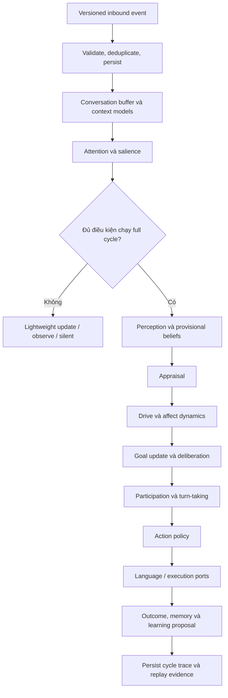

# BÁO CÁO HIỆN TRẠNG KIẾN TRÚC AELIA AGENT V2

## Kết quả triển khai, mức độ đáp ứng kiến trúc mục tiêu và các điều kiện còn thiếu

**Ngày báo cáo:** 24 tháng 8 năm 2026

**Phạm vi đánh giá:** Working tree cục bộ tại repository `AELIA`

**Kiến trúc mục tiêu:** Controlled rewrite từ Rust V1 sang Python V2

**Trạng thái tổng thể:** Hoàn thành local runtime backend và các platform gate đến
ranh giới live canary; chưa được phép gửi dữ liệu tới nền tảng thực tế

---

## 1. Tóm tắt điều hành

AELIA đã hoàn thành phần lớn nền kiến trúc được yêu cầu trong
*Báo cáo tái cấu trúc AELIA Agent* ngày 29 tháng 7 năm 2026. Kernel mới được
xây dựng bằng Python theo mô hình modular monolith, có hợp đồng dữ liệu chặt chẽ,
chu kỳ nhận thức tuần tự, trạng thái có vai trò nhân quả, lưu trữ SQLite, khả
năng truy vết và replay.

Các thành phần chính đã có mặt và được kiểm thử gồm:

- bảo toàn và cấu trúc hóa persona;
- observation loop, attention và conversation buffer;
- World, Belief, Self, Social và Conversation Model;
- appraisal, drive và affect dynamics;
- goal lifecycle, deliberation, participation, turn-taking và action policy;
- memory, outcome và learning proposal có kiểm soát;
- initiative cùng autonomy guardrails ở chế độ shadow;
- adapter contract, transactional outbox, idempotency và crash recovery;
- CLI phục vụ kiểm tra cấu hình, replay, trace và test-canary mô phỏng.

Kết quả kiểm chứng local gần nhất:

| Hạng mục | Kết quả |
|---|---:|
| Automated tests | **182 Python test và 34 Node test pass** |
| Ruff format/lint | Pass |
| Strict mypy | Pass trên `src` và `tests` |
| Persona | Hợp lệ; 43 quy tắc, 18 kịch bản |
| SQLite | 8 migration; integrity check đạt `ok` |
| V1 preservation | 205/205 file được bảo toàn byte-for-byte |
| V1 Cargo workspace | 13/13 package được nhận diện |

**Kết luận quản trị:** V2 đã sẵn sàng cho vòng review mã nguồn và đã có local
runtime backend độc lập. Provider OpenAI-compatible xác thực thành công; model
`uai/claude-sonnet-4-6` được liệt kê và full runtime HTTP smoke tạo được nội dung
qua backend. Ba connector Node.js `discord-selfbot`, `discord-officialbot` và
`telegram-officialbot` đã được triển khai độc lập, nhưng mặc định tắt gửi và
chưa chạy live canary. Vì vậy V2 **chưa phải bản production**.

Một điểm cần xử lý trước khi nghiệm thu chính thức: toàn bộ V2 và việc di chuyển
V1 hiện còn nằm trong working tree cục bộ, **chưa được commit, push hoặc mở pull
request**. Vì vậy, kết quả hiện tại là bằng chứng local chứ chưa phải artifact đã
được kiểm duyệt trên hệ thống quản lý mã nguồn.

---

## 2. Phạm vi và cơ sở đánh giá

Báo cáo này đối chiếu ba nguồn:

1. kiến trúc mục tiêu trong báo cáo tái cấu trúc ban đầu;
2. mã nguồn và test hiện có trong repository;
3. tài liệu acceptance, ADR, runbook và evidence matrix của V2.

Báo cáo phân biệt ba mức trạng thái:

- **Đạt local:** đã triển khai và có bằng chứng kiểm thử cục bộ;
- **Đạt có giới hạn:** kiến trúc và cơ chế an toàn đã có, nhưng chưa hoạt động
  với dịch vụ thật;
- **Chưa thực hiện:** cần quyết định, quyền truy cập hoặc môi trường bên ngoài.

Không có tuyên bố nào trong báo cáo này cho rằng V2 đã được kiểm thử production,
đã gửi tin nhắn thật hoặc đã thay thế một hệ thống đang vận hành.

---

## 3. Quyết định kiến trúc đã được hiện thực hóa

### 3.1 Kernel Python 100%

Kernel V2 được triển khai bằng Python 3.12+, không phụ thuộc Rust runtime. Rust
V1 không được port từng dòng và không được dùng làm chuẩn hành vi.

Các dependency runtime được giữ ở mức nhỏ:

- `pydantic` và `pydantic-settings` cho contract/config;
- `aiosqlite` cho persistence;
- không ORM;
- không graph database;
- không vector database;
- không workflow engine;
- không platform SDK trong kernel.

### 3.2 Modular monolith

V2 hiện là một process logic thống nhất, chia module theo trách nhiệm:

```text
src/aelia/
├── app/          # cấu hình và logging
├── contracts/    # event, action, trace, adapter, connector
├── persona/      # nguồn persona, selector, disclosure, participation bias
├── models/       # world, belief, self, social, conversation, goal, memory
├── cognition/    # attention → perception → appraisal → policy
├── autonomy/     # initiative và guardrails
├── llm/          # prompt registry và boundary
├── runtime/      # orchestrator, ports, replay, observability
├── storage/      # SQLite, migrations, repositories
├── adapters/     # adapter runtime và conformance
└── cli.py        # công cụ vận hành local
```

Hiện có 67 file Python production; test có 35 file. Các con số này chỉ mô tả quy
mô hiện tại, không được dùng thay thế cho đánh giá chất lượng.

### 3.3 Chu kỳ nhận thức tường minh

Luồng chính được giữ tuần tự và có thể truy vết:



Async và side effect được giới hạn ở các boundary. Kernel không dùng event bus
để thay thế các lời gọi bắt buộc trong cognitive cycle.

### 3.4 LLM là component, không phải policy authority

Kiến trúc đã tách:

- lựa chọn hành động;
- tạo content plan;
- tạo ngôn ngữ;
- thực thi side effect.

LLM không được trực tiếp:

- sửa canonical state;
- tự ghi belief bền vững;
- chọn và thực thi tool;
- bỏ qua permission hoặc guardrail;
- tự gửi dữ liệu ra platform.

Provider OpenAI-compatible hiện dùng async Chat Completions, typed/redacted
config, JSON output validation và retry có giới hạn. Model chỉ được tạo trường
`content` cho action đã chọn. Endpoint và authentication đã probe thành công;
`uai/claude-sonnet-4-6` được liệt kê và completion smoke qua backend đã tạo nội
dung.

---

## 4. Mức độ đáp ứng các vấn đề chiến lược của V1

| Mã | Vấn đề trong báo cáo gốc | Xử lý ở V2 | Đánh giá |
|---|---|---|---|
| P01 | Persona phụ thuộc prompt | Persona có source hash, rule provenance, Self/Social Model và policy causality | Đạt local |
| P02 | State chỉ mang tính mô tả | Appraisal, drive và affect thay đổi attention, retrieval, goal và action score | Đạt local |
| P03 | Worker/event overuse | Main cognitive cycle dùng orchestrator tuần tự | Đạt local |
| P04 | Crate fragmentation | Python modular monolith, dependency direction được test | Đạt local |
| P05 | Config precedence phân tán | Typed settings và `config doctor` cho resolved config | Đạt local |
| P06 | Nhiều memory store xung đột | SQLite là canonical store; projection phải rebuild được | Đạt local |
| P07 | Affect chạy post-hoc | Appraisal và internal dynamics chạy trước action policy | Đạt local |
| P08 | LLM quyết định quá nhiều | LLM nằm sau policy, qua typed ports | Đạt local |
| P09 | Thiếu observation loop | Bounded buffer, reply graph, salience và lightweight update | Đạt local |
| P10 | Thiếu participation policy | `observe`, `silent`, `wait`, `reply`, `join` đã có; reaction/live initiate chưa bật | Đạt có giới hạn |
| P11 | Thiếu turn-taking | Có saturation, ownership và anti-interruption rules | Đạt local |
| P12 | Thiếu initiative manager | Có trigger, budget và audit nhưng chỉ chạy shadow | Đạt có giới hạn |
| P13 | Thiếu deterministic replay | Có inspect/replay/compare/export/redact | Đạt local |
| P14 | Failure semantics không đồng nhất | Unit of work, rollback, retry history, idempotency và recovery | Đạt local |
| P15 | Platform coupling | Kernel không import SDK; adapter dùng contract riêng | Đạt local |
| P16 | Prompt là code ẩn | Prompt registry có owner, version, schema và hash trace | Đạt local |
| P17 | Storage đi trước domain | SQLite-first và repository boundary | Đạt local |
| P18 | Thiếu architecture governance | Có 13 ADR, Definition of Done và quality gate; chưa có commit/PR review | Đạt một phần |

Nhìn tổng thể, các nợ kiến trúc cốt lõi của V1 đã được xử lý ở tầng thiết kế và
kiểm thử local. Phần chưa chứng minh được nằm ở hành vi có model thật, connector
thật và môi trường vận hành thật.

---

## 5. Hiện trạng theo lộ trình triển khai

### Phase 0 — Freeze, inventory và bảo toàn V1

**Trạng thái: hoàn thành local, chờ ghi nhận trên Git.**

- V1 được chuyển vào
  [`legacy/v1-rust/`](../../legacy/v1-rust/README.md).
- 205/205 file implementation/config/documentation được đối chiếu byte-for-byte.
- Workspace Cargo vẫn đọc được đủ 13 package.
- `.env`, `.env.example`, `settings.json`, config, prompt, persona và dữ liệu
  local được giữ lại.
- Build cache, `node_modules`, `.next` và model cache được chuyển vào macOS
  Trash; không xóa vĩnh viễn.
- V1 không còn là dependency runtime hoặc fallback production của V2.

Điểm còn thiếu là commit/tag/PR chính thức ghi nhận trạng thái archive.

### Phase 1 — Python foundation

**Trạng thái: đạt local.**

- package Python và lockfile;
- strict typed contracts;
- typed configuration;
- JSON logging có cycle/event correlation;
- SQLite event log;
- idempotent event ingest;
- CLI database, inspect và replay;
- quality workflow cho Ruff, mypy và pytest.

### Phase 2 — Observation loop

**Trạng thái: đạt local.**

- bounded conversation buffer;
- reply graph;
- attention/salience scoring có reason code;
- lightweight update;
- fixture hội thoại nhóm 100 message;
- direct mention và anti-spam policy.

Agent không bắt buộc chạy full cognitive cycle cho mọi message.

### Phase 3 — Persistent models và memory foundation

**Trạng thái: đạt local.**

- World Model;
- Belief Model với confidence, evidence và provenance;
- Self Model;
- Social Model;
- Conversation Model;
- canonical memory reference;
- persistence qua restart;
- conflict và duplicate handling.

Observation không tự động trở thành fact. Belief có thể ở trạng thái provisional
hoặc contested.

### Phase 4 — Appraisal, Drive và Affect

**Trạng thái: đạt local.**

- appraisal có cấu trúc;
- drive/affect có inertia và decay;
- state delta xuất hiện trong cycle trace;
- internal state tham gia vào attention, memory retrieval, goal priority,
  participation và action scoring.

Điều này xử lý trực tiếp vấn đề “emotion chỉ thay đổi giọng văn” của V1.

### Phase 5 — Goal, Deliberation và Action Policy

**Trạng thái: đạt local.**

- goal lifecycle và merge;
- typed action candidates;
- scoring và reason breakdown;
- turn-taking;
- language/execution ports;
- structured failure outcome;
- failed execution không tự động đánh dấu goal hoàn thành.

### Phase 6 — Participation

**Trạng thái: đạt local cho phạm vi hiện tại.**

Đã hỗ trợ:

- `observe`;
- `silent`;
- `wait`;
- `reply`;
- guarded group `join`.

Agent có thể chọn tham gia hội thoại nhóm mà không cần bị tag, nhưng phải qua
conversation ownership, saturation, anti-spam và persona participation rules.

Reaction và các outcome nâng cao khác chưa được bật vì chưa có nhu cầu platform
đã được phê duyệt.

### Phase 7 — Initiative và autonomy

**Trạng thái: đạt ở chế độ shadow.**

Đã có:

- internal triggers;
- initiative proposal;
- actor/conversation opt-out;
- quiet hours;
- permission và privacy checks;
- rate, cost và outbound budgets;
- minimum-value, risk, reversibility và confirmation checks;
- autonomy audit log.

Initiative không thể tạo outbound action thật. Đây là chốt an toàn chủ đích, không
phải lỗi kỹ thuật.

### Phase 8 — Adapter boundary

**Trạng thái: hoàn thành boundary, connector offline và external receipt; chưa
chạy live canary.**

Đã có:

- versioned adapter envelope;
- outbound command và delivery receipt;
- transactional outbox;
- reconnect và idempotency;
- crash-window recovery;
- `shadow` mode;
- allowlisted `test_canary` với mock transport;
- allowlisted `external_canary`;
- connector capability preflight;
- Discord self-bot Node.js tách biệt khỏi kernel;
- Discord official bot dùng `discord.js`;
- Telegram official bot dùng Bot API HTTPS và durable polling cursor;
- common Node boundary cho journal, kernel CLI và receipt;
- journal chống gửi trùng và receipt `sent/not_sent/unknown`.

Chưa có bằng chứng live với credential/channel thật.

### Phase 9 — Data migration và decommission

**Trạng thái: điều chỉnh phạm vi.**

Theo quyết định sản phẩm hiện tại, dữ liệu runtime V1 không phải tài sản cần
migrate; persona là tài sản quan trọng cần bảo toàn. Do đó:

- không migrate numeric state hoặc memory store cũ;
- persona đã được bảo toàn và hash-bound;
- V1 đã được cách ly để tham khảo;
- chưa thể tuyên bố production decommission vì V2 chưa cutover platform thật.

### L9 — OpenAI-compatible LLM provider

**Trạng thái: đạt local với exact model; bounded persona evaluation và live
canary vẫn còn thiếu.**

Đã có:

- cấu hình typed cho API base, API key và model;
- secret chỉ nằm trong `.env` bị Git ignore và được redact khỏi doctor/log;
- async `POST /chat/completions`;
- `json_object` mặc định, `json_schema` tùy chọn;
- timeout, giới hạn token/response và tối đa ba lần thử;
- retry cho lỗi thiết lập kết nối, HTTP 408/409/429 và lỗi server; lỗi
  read/write mơ hồ không bị retry;
- lỗi model được lưu thành failed cycle có cấu trúc;
- replay dùng recorded generation, không gọi lại provider.

Probe `/models` xác thực thành công và chính mã model được chủ sở hữu chọn có
trong danh sách. Full synthetic Discord envelope qua backend hoàn tất với nội
dung sinh ra, `thinking_mode = "disabled"`, `max_output_tokens = 4096`, và
không tạo side effect Discord.

---

## 6. Hợp đồng, dữ liệu và khả năng phục hồi

### 6.1 Phiên bản contract hiện tại

| Contract | Phiên bản |
|---|---:|
| Kernel event | `2.0.0` |
| Kernel action | `2.2.0` |
| Kernel trace | `2.3.0` |
| Adapter inbound envelope | `1.0.0` |
| Adapter outbound command | `1.1.0` |
| Adapter delivery receipt | `1.1.0` |
| Connector capability | `1.0.0` |
| Future external receipt | `2.0.0` |

External receipt `2.0.0` mới chỉ là contract chuẩn bị trước, chưa được nối vào
runtime.

### 6.2 SQLite migrations

Tám migration hiện bao phủ:

1. event log và cycle foundation;
2. observation buffer, reply graph và participation;
3. canonical social relationship state;
4. beliefs và internal cognitive state;
5. goals và idempotent outbound actions;
6. canonical memory, outcomes và learning proposals;
7. initiative guardrails, opt-out và audit;
8. adapter ingress cùng transactional dispatch outbox.

SQLite là nguồn chuẩn duy nhất cho state bền vững. Working memory được dẫn xuất
từ bounded conversation buffer. Graph/vector store chưa được thêm vì chưa có
bằng chứng nhu cầu.

### 6.3 Failure và recovery

Đã có bằng chứng local cho:

- duplicate ingress không tạo cycle trùng;
- reconnect dùng lại ingress/cycle đã lưu;
- transaction rollback khi state contention;
- retry có lịch sử và giới hạn;
- reserved dispatch được recovery;
- mock transport dùng idempotency key;
- failed execution tạo structured outcome;
- trace có thể replay sau recovery.

Với connector thật, trường hợp “request có thể đã tới platform nhưng client
timeout” vẫn phải được giải quyết bằng platform lookup/reconciliation; hệ thống
không cho phép blind retry.

---

## 7. Persona và tính liên tục của sản phẩm

Persona Ryuuko được xác định là tài sản quan trọng nhất từ V1.

Các biện pháp bảo toàn:

- giữ nguyên bốn source artifact;
- xác minh SHA-256;
- giữ bản V1 gốc trong legacy archive;
- 43 quy tắc có liên kết về nguồn;
- 18 behavioral scenario;
- không dùng exact generated text làm oracle;
- persona được phân rã thành identity, values, boundaries, disclosure,
  relationship dynamics, participation và presentation policy.

Persona không còn chỉ là một system prompt. Self Model, Social Model,
relationship state, disclosure gate và participation bias tham gia trực tiếp
vào policy.

Giới hạn còn lại: smoke test mới chứng minh đường đi kỹ thuật và chưa thay thế
cho bounded persona evaluation. Vì vậy chưa thể kết luận chất lượng diễn đạt
cuối cùng hoặc độ ổn định dài hạn giữa các model/version.

---

## 8. Kiểm thử, observability và governance

### 8.1 Bằng chứng chất lượng local

Lần kiểm tra gần nhất:

```text
Ruff format: pass
Ruff lint: pass
Strict mypy: pass trên 102 source files được kiểm tra
Pytest: 165 passed
Persona doctor: valid, 43 rules, 18 scenarios
Cargo metadata V1: 13 workspace members, 13 packages
```

Test hiện có bao phủ:

- unit;
- contract;
- architecture/dependency direction;
- integration;
- behavioral persona;
- replay;
- adapter recovery;
- autonomy guardrails.

### 8.2 Observability

Cycle trace ghi nhận các thành phần quan trọng:

- input event;
- attention/participation reason;
- model delta;
- appraisal và internal-state delta;
- goal/candidate/action;
- prompt metadata;
- execution/outcome;
- retry/recovery.

CLI hỗ trợ inspect, replay, compare, export và redact. Log vận hành không ghi nội
dung message hoặc secret theo mặc định.

### 8.3 Governance

Đã có:

- ADR 0001–0014;
- Definition of Done;
- requirement-to-evidence matrix;
- adapter cutover/rollback runbook;
- connector acceptance kit;
- CI workflow định nghĩa quality gate.

Chưa có:

- commit chứa V2;
- remote CI run trên commit đó;
- pull request;
- code review hoặc approval record.

Do đó, trạng thái governance được đánh giá là **đã có cơ chế nhưng chưa hoàn tất
quy trình nghiệm thu**.

---

## 9. Các vướng mắc và rủi ro còn lại

### 9.1 Vướng mắc bắt buộc trước production

#### A. Chưa có live canary cho một connector được kích hoạt

Ba connector Node.js đã được triển khai ngoài kernel. Còn phải chọn một
connector và chứng minh trên đúng conversation được cấp phép:

- normalize payload đúng contract;
- mapping identity/conversation/permission;
- cursor/reconnect;
- idempotent send;
- lookup/reconcile khi delivery không rõ;
- rate-limit;
- secret redaction;
- kill switch.

#### B. Chưa hoàn tất bounded model-backed evaluation

Endpoint, authentication, model listing và full backend completion smoke đã
hoạt động với `uai/claude-sonnet-4-6`. Code đã có structured output, timeout,
retry, prompt trace và redaction. Việc còn thiếu:

- đánh giá persona có giới hạn với model thật;
- đo latency, token/cost và privacy trong môi trường được phê duyệt;
- chốt fallback khi provider không khả dụng.

#### C. Chưa có quyền và môi trường canary

Cần một test conversation được phê duyệt, credentials ngoài repository, người
vận hành có quyền bật/tắt, thời gian thử nghiệm và số lần gửi tối đa.

#### D. Chưa có source-control review

V2 và việc archive V1 chưa được commit/PR. Đây là blocker gần nhất để cấp trên
kiểm tra diff, chạy CI và phê duyệt kiến trúc.

### 9.2 Rủi ro kỹ thuật

| Rủi ro | Hiện trạng kiểm soát | Phần còn thiếu |
|---|---|---|
| Persona đúng cấu trúc nhưng diễn đạt không ổn định | Source-traced rules và scenario tests | Model-backed evaluation |
| Connector gửi trùng | Outbox/idempotency đã test với mock | Platform reconciliation thật |
| Autonomy gây spam | Shadow-only, opt-out, budget, quiet hours | Bounded live canary |
| Async/platform failure tạo trạng thái mơ hồ | Contract `unknown` và cấm blind retry | SDK-specific lookup |
| Privacy/secret leakage | Bounded logging và no live credential | Review theo platform/provider |
| Python architecture tiếp tục phình | Dependency tests, ADR, DoD | Human code review liên tục |
| Local pass nhưng remote không tái lập | Lockfile và CI workflow đã có | Commit/push và CI run thật |

### 9.3 Những gì chưa nên tuyên bố

Hiện chưa đủ bằng chứng để tuyên bố:

- V2 production-ready;
- V2 đã thay thế V1 trên platform;
- autonomous initiative an toàn trong môi trường thật;
- delivery exactly-once trên Discord/Telegram;
- persona output ổn định với model thật;
- vận hành dài hạn không có memory/state drift.

---

## 10. Quyết định cần cấp trên phê duyệt

Để chuyển từ “local architecture accepted” sang “authorized canary”, cần tối
thiểu các quyết định sau:

1. **Phê duyệt commit/PR hiện trạng** để tạo baseline V2 có thể review và rollback.
2. **Phê duyệt một bounded platform canary** trên đúng conversation/credential.
3. **Phê duyệt model `uai/claude-sonnet-4-6`** và bounded model evaluation,
   bao gồm giới hạn dữ liệu và chi phí.
4. **Chỉ định test conversation/channel** và danh sách action được phép.
5. **Chỉ định operator và canary budget:** thời gian, số lần gửi, kill switch,
   tiêu chí dừng.
6. **Phê duyệt cơ chế cấp secret** ngoài repository.
7. **Xác nhận persona là dữ liệu V1 duy nhất bắt buộc bảo toàn**, không yêu cầu
   migration runtime history/state cũ.

---

## 11. Kế hoạch đề xuất cho giai đoạn tiếp theo

### Gate 1 — Chốt baseline mã nguồn

- review báo cáo này;
- review diff V1 archive và V2;
- tạo branch/commit;
- chạy remote CI;
- xử lý review comments;
- gắn mốc baseline V2 local.

**Điều kiện qua gate:** commit được duyệt; 182 Python test, 34 Node test hoặc
nhiều hơn pass trên CI; không có secret bị commit.

### Gate 2 — Hoàn tất model và connector

- ADR platform/account model đã có;
- connector package ngoài kernel đã có;
- anonymized fixtures, contract tests và capability preflight đã có;
- exact model route đã được xác thực local;
- còn kiểm tra login/permission với credential thật.

**Điều kiện qua gate:** toàn bộ test offline pass; kernel vẫn không import SDK;
không có live send mode mặc định.

### Gate 3 — Authorized test conversation

- cấp credentials theo cơ chế đã duyệt;
- kiểm tra kill switch;
- chạy allowlist test conversation;
- thử duplicate, timeout trước gửi, timeout sau gửi, restart và permission loss;
- thu thập receipt/reconciliation evidence.

**Điều kiện qua gate:** không gửi trùng; không có delivery `unknown` chưa giải
thích; rollback về shadow hoạt động.

### Gate 4 — Bounded canary

- một conversation;
- giới hạn action và số lần gửi;
- observation window rõ ràng;
- review persona, participation, spam, privacy và cost;
- ghi nhận rollback evidence.

**Điều kiện qua gate:** được chủ hệ thống phê duyệt riêng sau khi xem evidence
package. Một canary thành công không tự động đồng nghĩa production approval.

---

## 12. Kết luận

AELIA đã vượt qua giai đoạn “bản thiết kế” và hiện có một kernel
Python chạy được, kiểm thử được, replay được và có boundary an toàn. Các quyết
định cốt lõi của báo cáo tái cấu trúc — modular monolith, deterministic core,
structured state, persona có vai trò nhân quả, SQLite-first, versioned contract,
safe autonomy và platform isolation — đã được hiện thực hóa ở mức local.

Phần còn thiếu không nằm ở việc tiếp tục mở rộng kernel một cách vô hạn. Nút
thắt hiện tại là:

1. đưa trạng thái hiện tại vào source control để review chính thức;
2. hoàn tất network/persona acceptance cho LLM và chọn connector canary;
3. chạy connector canary thật;
4. cấp môi trường/credentials có kiểm soát;
5. chứng minh hành vi qua test conversation và bounded canary.

Vì vậy, khuyến nghị hiện tại là **đóng scope kiến trúc kernel**, ưu tiên
source-control review và chuẩn bị canary. Không nên bật initiative hoặc live
delivery trước khi toàn bộ gate về permission, idempotency, receipt, privacy,
kill switch và rollback được chứng minh.

---

## 13. Tài liệu và bằng chứng liên quan

- [Implementation Status](IMPLEMENTATION_STATUS.md)
- [Final Local Audit](FINAL_AUDIT.md)
- [Requirement-to-Evidence Matrix](REQUIREMENT_EVIDENCE.md)
- [Definition of Done](DEFINITION_OF_DONE.md)
- [P8 Cutover and Rollback Runbook](P8_CUTOVER_RUNBOOK.md)
- [External Connector Acceptance Kit](CONNECTOR_ACCEPTANCE.md)
- [ADR 0013 — V1 isolation](adr/0013-isolate-v1-as-a-byte-preserved-legacy-environment.md)
- [ADR 0014 — OpenAI-compatible provider](adr/0014-openai-compatible-async-language-provider.md)
- [V1 Archive Inventory](../../legacy/v1-rust/ARCHIVE_INVENTORY.md)
- [V2 root README](../../README.md)
